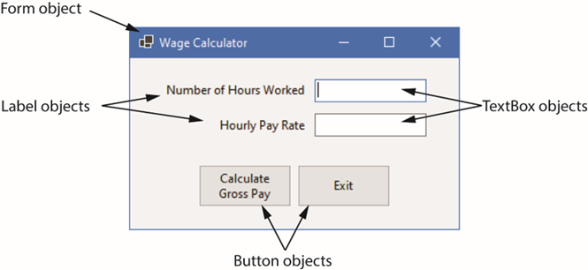

## chapter 1

## Topics
1.1 Objects
1.2 The Program Development Process
1.8 Getting Started with Visual Studio
2.1 Getting Started with Forms and Controls
2.2 Creating the G U I for Your First Visual C# Application
2.3 Introduction to C# code
2.4 Writing Code for the Hello World Application
2.5 Label Controls
2.6 Making Sense of IntelliSense
2.7 PictureBox Controls
2.8 Comments, Blank Lines, and Indentation
2.9 Writing the Code to Close an Application’s Form
2.10 Dealing with Syntax Errors

## Objects
An object is a program component that contains data and performs operations, Programs use objects to perform specific tasks.
Most programming languages use object-oriented programming in which a program component is called an “object”
Program objects have properties (or fields) and methods
Properties – data stored in an object
Methods – the operations an object can perform

## Objects that are visible in a program G U I are known as controls
Commonly used controls are Labels, Buttons, and TextBoxes
They enhance the functionality of your programs
There are invisible objects in a G U I such as Timers, and OpenFileDialog
A class is code that describes a particular type of object

## The Properties Window

The appearance and other characteristics of a G U I object are determined by the object's properties
Properties are settings that control how the object looks and behaves
The Properties window lists all properties
When selecting an object, its properties are displayed in Properties windows

## Message Boxes
A message box (a k a dialog box) displays a message
.NET provides a method named MessageBox.Show
The method displays a window with a message. A sample code is (bold line):

## Controls
An object is a program component that contains data and performs operations, Programs use objects to perform specific tasks.
Most programming languages use object-oriented programming in which a program component is called an “object”
Program objects have properties (or fields) and methods
Properties – data stored in an object
Methods – the operations an object can perform

## The Toolbox 
Toolbox is a window for selecting controls to use in an application
Typically appears on the left side of Visual Studio environment
Often is in Auto Hide mode

## .2 The Program Development Process

This means the steps used to create a program.

Main steps:
Understand the problem
Plan the solution
Write the code
Test the program
Fix errors
Maintain/improve the program

## 1.3 Getting Started with Visual Studio

Visual Studio is an IDE used to develop C# applications.

IDE means:

Integrated Development Environment

Visual Studio helps you:

Write code
Design forms
Find errors
Run programs
Debug programs

## What is a Control?

A Control is an object placed on a Form.

Examples:

Label
Button
TextBox
PictureBox

## Writing Code for the Hello World Application

The Hello World program is usually the first simple program beginners create.

Example:

MessageBox.Show("Hello World");

## 5 Label Controls

A Label is used to display text on a Form.

## 2.5 Label Controls
A Label control displays text on a form and can be used to display unchanging text or program output
Commonly used properties are:
Text: gets(read) or sets(write/change) the text associated with Label control
Name: gets or sets the name of Label control
Font: allows you to set the font, font style, and font size
BorderStyle: allows you to display a border around the control’s text
AutoSize: controls the way they can be resized
TextAlign: set the text alignments

## PictureBox Controls

A PictureBox control displays a graphic image on a form
Commonly used properties are:
Image: specifies the image that it will display
SizeMode: specifies how the control’s image is to be displayed
Visible: determines whether the control is visible on the form at run time

## Comments, Blank Lines, and Indentation
Comments

Comments explain the code. The computer does not execute them.
// means a single-line comment.

## Blank Lines

Blank lines make code easier to read.

Indentation

Indentation means putting spaces before code to make the structure clear.

## 2.10 Dealing with Syntax Errors
The Visual Studio code editor examines each statement as you type it and reports any syntax errors that are found
If a syntax error is found, it is underlined with a jagged line
If a syntax error exists and you attempt to compile and execute, you will see the following window
