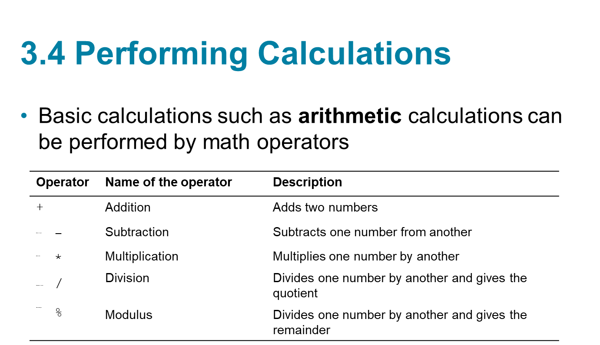

## chapter2
## Topics (1 of 2)
3.1 Reading Input with TextBox Controls
3.2 A First Look at Variables
3.3 Numeric Data Type and Variables
3.4 Performing Calculations
3.5 Inputting and Outputting Numeric Values
3.6 Formatting Numbers with the ToString Method
3.7 Simple Exception Handling
3.8 Using Named Constants
3.9 Declaring Variables as Fields
3.10 Using the Math Class
3.11 More G U I Details
3.12 Using the Debugger to Locate Logic Errors

## Reading Input with TextBox Control
TextBox control
a rectangular area
can accept keyboard input from the user
located in the Common Control group of the Toolbox
double click to add it to the form
default name is textBox

## The Text Property
A TextBox control’s Text property stores the user inputs
Text property accepts only string values, e.g.

## Data Types
variable must be declared with a proper data type
The data type specifies the type of data a variable can hold
many data types are known as primitive data types
they store fundamental types of data (means essential or core
such as strings and integers
## //
“Primitive” means basic / simple / built-in.
In C#, primitive data types are already defined by the language, not created by you.

## primitive 
Common primitive types:

int → whole numbers
double → decimal numbers
char → one character
bool → true or false
float, decimal, etc.

## non primitive
String → Array → Class → Object → Interface

## Variable Names
A variable name identifies a variable
Always choose a meaningful name for variables
Basic naming conventions are:
the first character must be a letter (upper or lowercase) or an underscore (_)
the name cannot contain spaces

## String Variables

A string is a combination of characters 
A variable of the string data type can hold any combination of characters, such as names, phone numbers, and social security numbers
The value of a string variable is assigned on the right of the = operator surrounded by a pair of double quotes:

## String Concatenation
Concatenation is the appending of one string to the end of another string
// the + operator is used for concatenation

## Local Variables and Scope

 A local variable belongs to the method in which it was declared
 Only statements inside that method can access the variable
 Scope describes the part of a program in which a variable may be accessed
 Lifetime of a variable is the time period during which the variable exists in memory while the program is executing
 A local variable is created in memory when the method in which it is declared starts executing. When the method ends, all the method’s local variables are destroyed.
 
 ## Duplicate Variable Names
 You cannot declare two variables with the same name in the same scope. 
 For example, if you declare a variable named productDescription in an event handler, you cannot declare another variable with that name in the same event handler. 
 You can, however, have variables of the same name declared in different methods
 
 ## Assignment Compatibility 
 You can assign a value to a variable only if the value is compatible with the variable’s data type.
  Only strings are compatible with the string data type
 
 ## Declaring Multiple Variables with One Statement
 You can declare multiple variables of the same data type with one declaration statement. Here is
  ## an example:
 string lastName, firstName, middleName;
 
 ## Remember, you can break up a long statement, so it spreads across two or more lines. Sometimes you will see long variable declarations written across multiple lines, like this:
 string lastName = "Khalaf",
        firstName = "Mohamed",
        middleName = "Abdullahi";
 
 ## 3.3 Numeric Data Types and Variables

 If you need to store a number in a variable and use the number in a mathematical operation, the variable must be of a numeric data type
 
 ## double: real numbers including numbers with fractional parts
 decimal: real numbers, stored with greater precision than doubles. Typically used in financial applications.
 
 ## Assignment Compatibility for int Variables
 You can assign int values to int variables, but you cannot assign double or decimal values to int variables. For example,
 
 ## Explicit Conversion with Cast Operators

 You can use the cast operator which is simply the name of the type enclosed in parentheses

 double realNumber;
 decimal moneyNumber = 625.70m;
 realNumber = (double)moneyNumber;

 ## Declaring Local Variables with the var Keyword

 var is a keyword you can use instead of writing the full type of a variable.
 The compiler automatically figures out the type from the value you assign (this is called type inference).
 You can use the var keyword to declare and initialize a local variable. Example:
 
 ## example 
 var interestRate = 12.0;
 var stockCode = "D465U";
 var accountBalance = 1000.0m;
 
 You must provide an initialization value when declaring a variable with var.
 The compiler determines the variable's data type from the initialization value.
 The var keyword can be used only to declare local variables (variables declared inside a method).
 Later you will see how var can simplify complex declarations.
 
 ## 3.4 Performing Calculations
 Basic calculations such as arithmetic calculations can be performed by math operators
 

## 3.5 Inputting and Outputting Numeric Values
Input collected from the keyboard are considered combinations of characters (or string literals) even if they look like a number to you
A TextBox control reads keyboard input, such as 25.65. However, the TextBox treats it as a string, not a number.
If the user has entered a numeric value into a TextBox control and you want to assign that value to a numeric variable, you have to convert the control’s Text property to the desired numeric data type. Unfortunately, you cannot use a cast operator to convert a string to a numeric type. 

## example
 int hoursWorked = int.Parse(hoursWorkedTextBox.Text);
double temperature = double.Parse(temperatureTextBox.Text);

 

